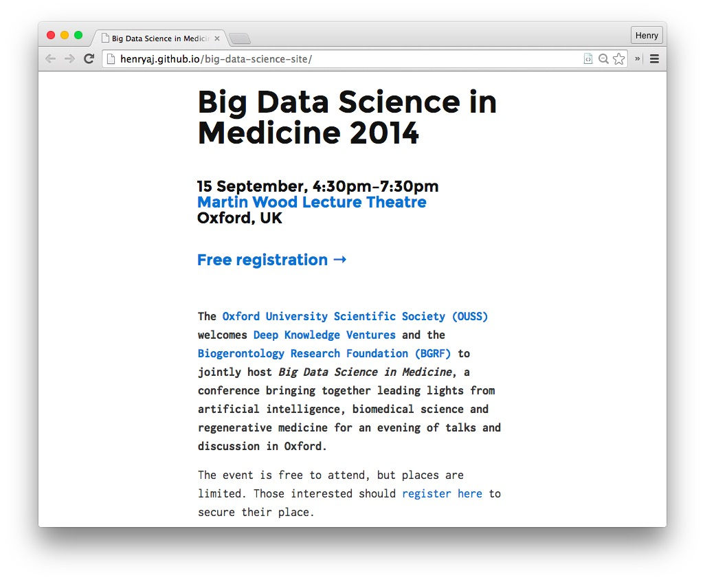

# Big Data Science in Medicine 2014

A single-page website for a PR client – partly for them, and partly as an excuse to learn how to use Jekyll (and feed my love for writing documents in Markdown)!

## Brief

The BGRF is a UK-based biogerontology charity and was organising an evening of talks at the University of Oxford. I wanted a simple, performant website that could be hosted cheaply and wouldn't die (I've had too many Wordpress installs go down on me at this point).

## Spec

* [Jekyll](jekyllrb.com)
* theme: [Solo](http://solo.chibi.io/), slightly modified
* free hosting from GitHub
